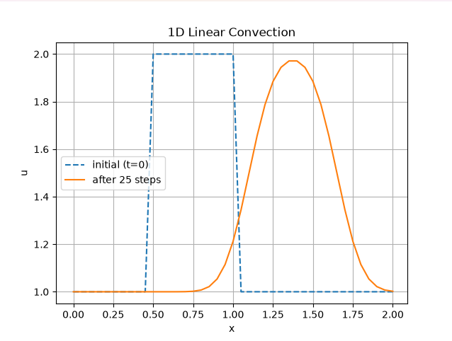

# 1D Linear Convection

My first step in understanding computational fluid dynamics (CFD) was solving the 1D linear convection equation.

  du/dt + c * du/dx = 0

using a simple finite-difference scheme in Python.

## What it does

Starts with a top-hat function as an initial profile and advances it forward in time
by approximating the derivatives with discrete differences between grid points.
Plots the initial state against the state after a chosen number of timesteps

## Learned

- Finite-difference approximation of partial differential equations
- Numerical diffusion (how the initial "sharp" edges diffuse over time)
- The Courant-Friedrichs-Lewy stability condition
-   how wave speed, timestep size, and grid spacing interact to keep a simulation stable

## Running the software

  pip install numpy matplotlib
  python 1D_linear_convection.py

# Next

Extend this toward nonlinear convection, diffusion, and Burgers' equation
- Burgers' equation: the foundational steps for more complex fluid simulations, especially relevant to nuclear thermal-hydraulics (a part of my research combining CFD with nuclear engineering)
